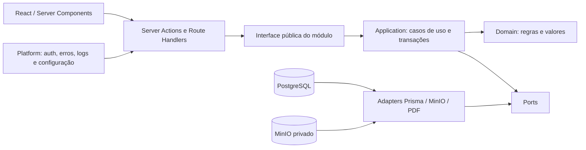

# Arquitetura backend Barracar Gestão v1

## 1. Objetivo e escopo

Este documento adapta os princípios de `ARQUITETURA-BACKEND-v2.md` ao sistema que existe hoje. A decisão é evoluir o Barracar Gestão como um **monólito modular incremental dentro do mesmo repositório Next.js**, sem reescrita e sem troca de stack.

O contexto é deliberadamente simples: uma única empresa de estética automotiva, equipe interna pequena, implantação privada e volume compatível com uma instância da aplicação. A arquitetura deve melhorar segurança, testabilidade e clareza sem introduzir complexidade de SaaS, multiempresa ou sistemas distribuídos.

### Dentro do escopo

- Next.js App Router, React e TypeScript estrito;
- Prisma e PostgreSQL;
- MinIO com API compatível com S3 e bucket privado;
- Auth.js com os papéis `ADMIN` e `EMPLOYEE`;
- Server Components, Server Actions e Route Handlers como adaptadores de entrada;
- Vitest para regras e integração de serviços, Playwright para fluxos essenciais;
- geração e versionamento de PDF, checklist, fotos e assinaturas;
- PWA e comportamento responsivo existentes.

### Fora do escopo agora

- reescrita em Fastify, NestJS ou outro backend;
- backend ou repositório separado;
- microserviços, Kubernetes, Kafka, service mesh ou multi-região;
- Redis obrigatório, filas obrigatórias ou múltiplas réplicas;
- GraphQL, CQRS generalizado ou event sourcing;
- multi-tenancy, RLS multiempresa, sharding ou SaaS;
- antivírus obrigatório, IA no backend ou abstrações genéricas sem uso real.

## 2. Estado atual confirmado

### Estado de adoção em 2026-08-02

- fase 0 concluída com inventário, mapa, ADRs, matriz e findings;
- fundação da fase 1 aplicada em `server/platform` com capacidades, erros estruturados, request ID, logs e health/readiness;
- Histórico é o módulo piloto em `server/modules/history`, consumido pela interface pública;
- `server/services/history.ts` permanece como fachada temporária para testes/imports legados;
- Ordens, storage/documentos e demais módulos continuam nas fases seguintes e não foram movidos em massa.

O projeto já segue parte importante deste desenho:

- `app/` contém páginas privadas, Server Actions e APIs;
- `server/services/` concentra os fluxos mais sensíveis de ordens, checklist, mídia, documentos e histórico;
- `lib/db.ts` mantém uma instância Prisma compartilhada;
- `lib/storage.ts` define `PrivateStorage` e o adaptador MinIO/S3;
- `auth.ts`, `middleware.ts` e `lib/authorization.ts` protegem sessão e páginas;
- o schema Prisma possui restrições úteis de unicidade e índices;
- operações críticas usam transações e auditoria;
- a suíte cobre regras, serviços e fluxos E2E.

O estado ainda é híbrido. Cadastros e parte dos Route Handlers acessam Prisma diretamente, as verificações de papel estão espalhadas e não há um contrato único de erro, logs estruturados ou health/readiness da aplicação. Isso é dívida arquitetural administrável, não motivo para reescrever o sistema.

## 3. Arquitetura alvo



Estrutura de destino, criada somente conforme cada módulo for tocado:

```text
app/                               # UI e adaptadores de entrada Next.js
server/
  modules/
    <module>/
      public.ts                    # única superfície importável por outros módulos
      domain/                      # regras puras, tipos e invariantes
      application/                 # casos de uso, portas e limites transacionais
      adapters/                    # Prisma, MinIO, PDF e integrações concretas
  platform/
    auth/
    config/
    database/
    storage/
    observability/
    errors/
    jobs/                          # somente quando houver necessidade comprovada
  shared/
    kernel/                        # poucos tipos estáveis e realmente compartilhados
prisma/                            # schema e migrações preservados
```

Não se deve criar todas essas pastas vazias. O primeiro módulo piloto cria apenas o necessário e estabelece um modelo replicável.

## 4. Regras de dependência

Dentro de um módulo, o sentido é:

```text
domain <- application <- adapters <- app/Next.js
```

- `domain` não importa Next.js, Prisma, MinIO, Auth.js nem componentes React;
- `application` usa regras de domínio e declara portas específicas ao caso de uso;
- `adapters` implementam portas com Prisma, MinIO, PDF ou outra infraestrutura;
- `app/` valida o formato de entrada, resolve ator/contexto, chama o caso de uso e converte o resultado para HTTP/UI;
- outro módulo importa apenas `server/modules/<módulo>/public.ts`;
- componentes React não contêm decisões de negócio;
- `server/platform` fornece mecanismos; decisões como “quem pode alterar uma foto encerrada” continuam no módulo responsável;
- não criar `GenericRepository`, `BaseService` ou abstração universal. Portas devem representar necessidades reais, como `WorkOrderRepository` ou `ObjectStorage`.

Consultas de página podem usar projeções específicas enquanto o módulo ainda não foi migrado. Ao tocar um fluxo de escrita, a prioridade é mover a decisão e a transação para a camada de aplicação, não apenas trocar o local do import.

## 5. Limites dos módulos

Os módulos funcionais são: autenticação, usuários, clientes, veículos, funcionários, serviços, ordens de serviço, agenda, financeiro, checklists, vistorias, documentos, histórico, configurações, pós-venda e notificações. A propriedade detalhada, as rotas e os arquivos atuais estão em [module-map.md](./module-map.md).

Regras principais de colaboração:

- Ordens orquestram cliente, veículo, itens de serviço, agenda e lançamento financeiro por interfaces públicas;
- Financeiro é dono do lançamento e de sua situação, mesmo quando originado por uma ordem;
- Vistorias são donas de metadados e regras das fotos; storage é apenas o mecanismo de bytes;
- Documentos são donos de versões, estado atual/desatualizado e geração do PDF;
- Histórico é um read model especializado, sem se tornar um barramento CQRS genérico;
- Pós-venda e notificações permanecem planejados até haver fluxo efetivo.

## 6. Persistência, dinheiro, datas e transações

### Prisma e PostgreSQL

- Prisma continua como adaptador oficial de persistência;
- migrações antigas são imutáveis; correções futuras entram em novas migrações;
- restrições do banco complementam validação de aplicação;
- transações começam e terminam nos casos de uso da camada de aplicação;
- um caso de uso pode receber um contexto transacional tipado, sem expor Prisma ao domínio;
- a aplicação permanece single-tenant, portanto não se adiciona `tenantId` nem RLS multiempresa.

### Dinheiro

- persistência em `Decimal(12,2)` é preservada;
- formulários convertem valores para centavos antes de cálculos importantes;
- somas, descontos e totais não usam ponto flutuante como fonte de verdade;
- moeda padrão é BRL e a formatação pertence à borda de apresentação;
- nenhuma atualização financeira automática deve ignorar o vínculo único com a ordem.

### Datas

- instantes operacionais continuam em `DateTime`/UTC;
- datas civis financeiras são interpretadas pela função de data civil e fuso configurado;
- intervalos mensais e anuais usam limites semiabertos `[início, próximo início)`;
- parsing e formatação permanecem centralizados em `lib/date-time.ts` até a migração para platform/shared.

### Idempotência e concorrência

| Operação | Proteção atual | Evolução recomendada |
| --- | --- | --- |
| Marcar OS como paga | transação + `FinancialEntry.workOrderId @unique` + `upsert` | aceitar `operationId` em entradas externas se houver repetição por rede |
| Sincronizar agenda da OS | `Appointment.workOrderId @unique` + `upsert` | manter o caso de uso como único escritor da agenda originada por OS |
| Gerar PDF | lock transacional advisory + versão única + tentativas + compensação do objeto | registrar `operationId` e resultado quando geração for assíncrona |
| Salvar assinatura | unicidade por OS/tipo + substituição transacional + remoção do objeto antigo | manter checksum e permitir repetição pelo mesmo identificador de operação |
| Upload de foto | chave aleatória, checksum, metadados e compensação se o banco falhar | chave de idempotência por arquivo/lote se uploads móveis duplicados aparecerem |
| Thumbnail | criado deterministicamente junto do original | persistir estado de processamento se for movido para job |
| Notificação/lembrete futuro | ainda não implementado | chave única por evento, canal e destinatário; gravação antes do envio |

## 7. Autenticação e autorização

Auth.js, credenciais, sessão JWT curta e revalidação do usuário no banco são preservados. O middleware continua como barreira de sessão, mas a autorização de negócio é sempre repetida no servidor.

A evolução é centralizar **capacidades**, não espalhar comparações com `ADMIN`:

```ts
type Capability =
  | "customers:manage"
  | "work-orders:read"
  | "work-orders:manage"
  | "finance:manage"
  | "inspections:collect"
  | "history:export"
  | "settings:manage";
```

Uma função de platform resolve o ator autenticado e suas capacidades. O módulo ainda decide condições do recurso, por exemplo status da OS, autoria, evidência bloqueada e justificativa. Páginas, Server Actions e APIs devem usar o mesmo contrato. Nunca confiar em ocultação visual do botão.

A matriz proposta e os testes negativos estão em [security-matrix.md](./security-matrix.md).

## 8. Armazenamento privado

O MinIO continua como armazenamento privado compatível com S3. O banco guarda metadados; o bucket guarda bytes.

Contrato alvo:

```ts
interface ObjectStorage {
  put(input: { key: string; bytes: Uint8Array; contentType: string }): Promise<void>;
  get(key: string): Promise<Uint8Array>;
  delete(key: string): Promise<void>;
}
```

Regras:

- bucket privado e downloads somente por Route Handler autenticado e autorizado;
- chave gerada pelo sistema, nunca pelo nome fornecido pelo cliente;
- MIME identificado pelos bytes, não somente pelo cabeçalho ou extensão;
- limites de quantidade/tamanho e apenas JPEG, PNG e WebP para fotos;
- SVG não é aceito;
- SHA-256, tamanho, dimensões, MIME e nome original ficam como metadados;
- original e thumbnail possuem chaves distintas;
- fotos relevantes são removidas logicamente e mantêm auditoria;
- falha entre objeto e banco usa compensação e deve ser reconciliável;
- antivírus não é requisito atual; reavaliar apenas se surgirem uploads públicos ou risco regulatório.

O `PrivateStorage` atual já é uma boa costura. A migração futura deve movê-lo para platform e impedir que Route Handlers acessem Prisma/storage diretamente quando houver uma política de recurso correspondente.

## 9. Erros

`DomainError` e `actionFailure` já impedem vazamento de mensagens internas. O próximo passo é um contrato estável compartilhado pelas bordas:

```json
{
  "code": "WORK_ORDER_NOT_FOUND",
  "title": "Ordem de serviço não encontrada",
  "status": 404,
  "detail": "A ordem informada não está disponível.",
  "requestId": "req_...",
  "fields": { "workOrderId": "Verifique o identificador." }
}
```

- `code` é estável e próprio do módulo;
- `title` é uma descrição curta e segura;
- `status` é usado em HTTP e mapeado adequadamente em Server Actions;
- `detail` nunca contém SQL, stack, segredo ou caminho interno;
- `requestId` correlaciona suporte e log;
- `fields` é opcional e contém erros de validação seguros;
- Prisma, Zod e SDKs são traduzidos na borda; não vazam como contrato público.

## 10. Observabilidade e auditoria

O nível proporcional para a operação atual é:

- logs estruturados em JSON no servidor;
- `request_id` por requisição e `operation_id` para operações repetíveis;
- campos mínimos: timestamp, level, module, route/action, duration_ms, result, user_id quando permitido;
- dados pessoais, cookies, senhas, tokens, bytes, URLs assinadas e payloads completos são sanitizados;
- `/api/health` verifica o processo sem dependências;
- `/api/ready` testa conexão leve com PostgreSQL e acesso/configuração do MinIO, com timeout;
- `AuditLog` continua separado dos logs técnicos e registra decisões de negócio relevantes;
- alertas complexos, tracing distribuído e plataforma externa não são necessários agora.

## 11. Jobs em segundo plano

Não há justificativa atual para Redis, BullMQ ou worker separado. Um job passa a ser considerado quando ao menos um destes sinais existir:

- a operação excede de forma recorrente o tempo aceitável de uma requisição;
- precisa de retentativa após reinício;
- depende de provedor externo instável;
- precisa ser agendada;
- consome CPU/memória a ponto de afetar requisições;
- precisa de controle de concorrência ou deduplicação durável.

Modelo mínimo futuro:

```text
Job: id, type, payloadVersion, payload, status,
attempts, maxAttempts, runAfter, lockedAt, lockedBy,
operationId, lastErrorCode, createdAt, updatedAt, completedAt
```

Começar com uma tabela PostgreSQL e um executor no mesmo código-base costuma ser suficiente. Só adotar fila externa quando métricas demonstrarem a necessidade. A decisão está em [adr/003-background-jobs-when-needed.md](./adr/003-background-jobs-when-needed.md).

## 12. Histórico e relatórios

Histórico é uma projeção de leitura especializada sobre ordens, financeiro, agenda, clientes, veículos, serviços e funcionários. Ele pode:

- consultar Prisma com projeções próprias e índices dedicados;
- compor resumo, rankings e séries mensais;
- exportar CSV/PDF;
- ter paginação e limites próprios;
- receber otimizações sem transferir propriedade de escrita das entidades.

Isso não cria CQRS generalizado. O sistema continua com um único modelo transacional; apenas reconhece que relatórios têm necessidades de leitura diferentes.

## 13. Desempenho e escala

Medidas atuais suficientes:

- projeções `select`/`include` conscientes;
- paginação de listas e exportação explicitamente não paginada;
- índices nos períodos e relações mais consultados;
- thumbnails para galeria;
- limites de upload;
- uma instância da aplicação, PostgreSQL e MinIO.

Reavaliar cache, Redis, réplica ou job quando houver evidência: p95 de páginas acima da meta por períodos seguidos, pool de conexões saturado, relatórios grandes, filas de upload, memória/CPU sustentadas ou necessidade real de múltiplas réplicas. Antes disso, medir e corrigir consulta/índice.

Casos de capacidade a testar no futuro: 100 mil OS, exportação anual, 500 fotos numa OS, 10 uploads concorrentes, regeneração simultânea de PDF, duplo clique de pagamento e indisponibilidade temporária de MinIO.

## 14. Estratégia de testes e gates

- domínio: testes unitários rápidos, sem banco;
- aplicação: testes de casos de uso, transação, autorização e idempotência;
- adaptadores: integração Prisma/PostgreSQL e contrato MinIO;
- borda: Route Handlers e Server Actions com respostas seguras;
- E2E: login, módulos principais, menu responsivo, histórico e fluxos críticos de OS;
- segurança: cenários negativos da matriz;
- arquitetura: teste simples opcional para impedir importações de `app/` no domínio e imports internos entre módulos.

Gates obrigatórios de cada mudança:

```powershell
npx.cmd tsc --noEmit
npm.cmd run lint
npm.cmd test
npm.cmd run build
```

Playwright deve rodar para mudanças de fluxo ou antes de releases; exige serviços e aplicação local.

## 15. Decisões: agora, depois e rejeitadas

### Agora

- documentar limites e dependências;
- padronizar erros, ator/capacidades e correlação;
- adicionar health/readiness e logs sanitizados;
- migrar um módulo piloto quando ele for alterado;
- preservar transações, restrições, storage privado e auditoria já existentes.

### Depois, mediante sinal real

- tabela de jobs e executor;
- reconciliação periódica de objetos órfãos;
- cache ou múltiplas réplicas;
- observabilidade externa;
- canal de notificações e automação de pós-venda;
- testes de carga e rotina formal de backup/restore.

### Rejeitadas para o contexto atual

- reescrita ou backend separado;
- microserviços e infraestrutura distribuída;
- Redis/Kafka como pré-requisito;
- GraphQL, CQRS generalizado e event sourcing;
- multi-tenancy/RLS multiempresa;
- abstrações genéricas antecipadas.

## 16. Caminho de adoção

A adoção é por fatias verticais e reversíveis, descrita em [architecture-migration-plan.md](./architecture-migration-plan.md). Nenhuma fase exige mover todos os módulos. Código legado funcional pode coexistir com módulos organizados, desde que novas dependências respeitem a direção e cada migração tenha teste e rollback.

## 17. Glossário

- **Borda**: Server Action, Route Handler, página/Server Component ou comando que recebe uma entrada externa.
- **Caso de uso**: operação de aplicação que coordena regra, autorização e transação.
- **Porta**: interface específica exigida por um caso de uso.
- **Adaptador**: implementação concreta de porta, por exemplo Prisma ou MinIO.
- **Capacidade**: ação autorizável, independente da forma visual da interface.
- **Idempotência**: repetir uma solicitação sem duplicar seu efeito.
- **Read model**: consulta/projeção otimizada para leitura, sem propriedade sobre as escritas de origem.
- **Audit log**: registro de ação de negócio; não substitui log técnico.
