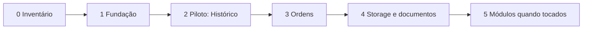

# Plano incremental de migração arquitetural

## Estado atual

| Fase | Estado em 2026-08-02 | Evidência |
| --- | --- | --- |
| 0 — Inventário | concluída | documentos, ADRs, matriz e findings |
| 1 — Fundação | fundação inicial concluída | `server/platform/{auth,errors,observability}`, `/api/health`, `/api/ready`, middleware e testes |
| 2 — Piloto | primeira fatia concluída | `server/modules/history`, `public.ts`, adapter Prisma, bordas migradas e teste arquitetural |
| 3 — Ordens | pendente | permanece em `server/services/work-orders.ts` |
| 4 — Storage/Documentos | pendente | interfaces atuais preservadas |
| 5 — Demais módulos | sob demanda | sem movimentação em massa |

“Concluída” neste quadro significa que a fundação planejada foi entregue; adoção por todos os chamadores continua incremental.

## Princípios de execução

- Uma fase entrega valor isolado e pode ser revertida sem restaurar o repositório inteiro.
- Código atual funcional permanece no lugar até existir substituto testado.
- Não alterar migrações Prisma já aplicadas.
- Evitar mudanças visuais e funcionais não relacionadas.
- Cada módulo migrado passa a ser exemplo, não justificativa para mover todos os demais.
- Todo gate deve passar antes da próxima fase.

## Fase 0 — Inventário e baseline

### Objetivo

Registrar o estado real, limites atuais, dependências, riscos e qualidade antes de mudar código.

### Arquivos

- `docs/architecture-backend-barracar-v1.md`
- `docs/module-map.md`
- `docs/architecture-migration-plan.md`
- `docs/adr/*.md`
- `docs/security-matrix.md`
- `docs/architecture-findings.md`

### Atividades

- mapear páginas, Server Actions, APIs, serviços, Prisma e MinIO;
- confirmar autenticação/autorização, transações, idempotência e auditoria;
- registrar findings com evidência e prioridade;
- executar typecheck, lint, Vitest e build sem mudança funcional.

### Risco

Baixo. O principal risco é documentação ficar genérica ou divergente do código; mitigar citando arquivos atuais e revisando-a em mudanças relevantes.

### Testes

- gates completos do repositório;
- revisão manual dos documentos contra schema e rotas.

### Critérios de aceitação

- oito documentos exigidos existem e são coerentes entre si;
- todos os módulos e recursos críticos estão mapeados;
- nenhuma funcionalidade, dependência ou migração foi alterada;
- working tree contém apenas documentação prevista.

### Rollback

Remover somente os novos documentos.

### Esforço relativo

Pequeno.

## Fase 1 — Fundação não invasiva

### Objetivo

Criar contratos transversais mínimos para ator/capacidades, erros, correlação, logs e saúde sem mover módulos de negócio.

### Arquivos previstos

```text
server/platform/auth/*
server/platform/errors/*
server/platform/observability/*
server/platform/config/*
app/api/health/route.ts
app/api/ready/route.ts
auth.ts                         # fachada/integração preservada
lib/authorization.ts           # fachada temporária
lib/action-state.server.ts      # mapeador compatível
middleware.ts
```

### Atividades

1. Definir `Actor`, `Capability` e `requireCapability`, preservando `ADMIN`/`EMPLOYEE`.
2. Migrar uma página e uma Server Action para comprovar o contrato; manter as demais compatíveis.
3. Evoluir erro seguro para `code`, `title`, `status`, `detail`, `requestId` e `fields`.
4. Gerar/propagar `request_id`; adicionar logger JSON sanitizado.
5. Implementar liveness sem dependências e readiness com PostgreSQL/MinIO e timeout.
6. Adicionar testes de autorização negativa, sanitização e health/readiness.
7. Opcionalmente adicionar teste arquitetural pequeno para imports proibidos.

### Risco

Médio. Código transversal pode mudar respostas ou redirecionamentos. Introduzir fachadas e migrar poucos chamadores por vez.

### Testes

- unitários de capabilities e tradução de erros;
- Route Handler tests para 401/403/404 e ausência de detalhes internos;
- readiness com dependência disponível/indisponível;
- E2E de login ADMIN/EMPLOYEE;
- gates completos.

### Critérios de aceitação

- não há regressão na sessão atual;
- ações migradas revalidam capacidade no servidor;
- erros novos têm código e `requestId`, sem stack/SQL/segredo;
- logs correlacionam operação sem dados sensíveis;
- health e readiness diferenciam processo vivo de dependências prontas.

### Rollback

Manter fachadas antigas e reverter chamadores migrados; remover rotas/propagação de correlação sem tocar módulos de negócio.

### Esforço relativo

Médio.

## Fase 2 — Módulo piloto

### Escolha recomendada

**Histórico** é o piloto preferido: é leitura, já está isolado em `server/services/history.ts`, possui testes e não coordena escrita. Documentos ou Vistorias são alternativas caso sejam a próxima área de produto, mas têm risco maior por storage e evidência.

### Objetivo

Validar a estrutura modular, `public.ts`, contratos, adaptador Prisma e testes sem alterar resultado da UI/exportação.

### Arquivos previstos para Histórico

```text
server/modules/history/public.ts
server/modules/history/application/get-history.ts
server/modules/history/application/contracts.ts
server/modules/history/domain/period.ts       # apenas regras realmente puras
server/modules/history/adapters/prisma-history-reader.ts
app/(private)/historico/page.tsx
app/api/history/export/route.ts
server/services/history.ts                    # fachada temporária ou remoção ao final
```

### Atividades

- definir consulta pública sem expor tipos Prisma;
- mover composição de leitura para application e consultas para adapter;
- manter filtros, paginação, resumo anual e exportação idênticos;
- impedir imports profundos do módulo;
- preservar `lib/history-period.ts` até haver ganho real em movê-lo;
- documentar as convenções aprendidas.

### Risco

Baixo/médio. Períodos, arredondamento, paginação e igualdade entre tela/exportação são sensíveis.

### Testes

- intervalos mensal, anual e personalizado;
- resumo versus registros e tela versus exportação;
- busca/filtros/paginação;
- exportação somente ADMIN;
- E2E do Histórico;
- gates completos.

### Critérios de aceitação

- UI, CSV e PDF não mudam semanticamente;
- bordas importam somente `server/modules/history/public.ts`;
- domínio/application não importam Next.js;
- tipos Prisma ficam no adaptador;
- todos os testes atuais permanecem verdes.

### Rollback

Manter o serviço antigo como fachada durante uma versão; reverter os dois chamadores para `server/services/history.ts`.

### Esforço relativo

Médio.

## Fase 3 — Ordens de serviço

### Objetivo

Organizar o agregado central e explicitar colaboração com Agenda e Financeiro preservando as transações e a idempotência atuais.

### Arquivos previstos

```text
server/modules/work-orders/public.ts
server/modules/work-orders/domain/*
server/modules/work-orders/application/*
server/modules/work-orders/adapters/prisma-*.ts
server/modules/appointments/public.ts         # interface mínima necessária
server/modules/finance/public.ts              # interface mínima necessária
app/(private)/ordens/actions.ts
app/(private)/ordens/[id]/actions.ts
server/services/work-orders.ts                # fachada durante transição
```

### Atividades

1. Extrair valores/regras puras: itens, centavos, totais e transições.
2. Criar casos de uso `saveWorkOrder`, `markPaid` e `cancelPayment`.
3. Declarar portas específicas para persistência e colaborações.
4. Manter uma transação Prisma para as alterações atomicamente necessárias.
5. Preservar `upsert`, relações únicas e auditoria.
6. Adicionar `operationId` somente nas entradas em que repetição por rede for relevante.

### Risco

Alto. É o fluxo central e cruza financeiro, agenda, documentos e auditoria. Migrar um caso de uso por vez.

### Testes

- cliente/veículo incompatíveis;
- itens adicionados, atualizados e removidos;
- centavos, desconto e total;
- criação/atualização/cancelamento de agenda;
- duplo pagamento sem lançamento duplicado;
- reversão preservando auditoria;
- falha no meio da transação não deixa estado parcial;
- E2E de criar/editar/pagar OS;
- gates completos.

### Critérios de aceitação

- relações únicas e transações mantêm os mesmos efeitos atuais;
- nenhuma borda escreve Agenda/Financeiro diretamente para operações da OS;
- regras não dependem de React/Next;
- auditoria contém ator e ação;
- cenários de repetição e concorrência passam.

### Rollback

Cada novo caso de uso mantém assinatura compatível com o serviço antigo. Reverter o import da borda e manter schema intacto.

### Esforço relativo

Grande.

## Fase 4 — Storage, Vistorias e Documentos

### Objetivo

Uniformizar acesso privado aos objetos e políticas de fotos, assinaturas e PDFs sem trocar MinIO.

### Arquivos previstos

```text
server/platform/storage/*
server/modules/inspections/*
server/modules/documents/*
app/api/media/photos/[id]/route.ts
app/api/media/signatures/[id]/route.ts
app/api/media/documents/[id]/route.ts
app/api/work-orders/[id]/photo-options/route.ts
app/(private)/ordens/[id]/actions.ts
server/services/media.ts                       # fachada temporária
server/services/documents.ts                   # fachada temporária
```

### Atividades

- mover o adaptador MinIO para platform e manter uma porta pequena;
- criar casos de uso autorizados de download, upload, edição e remoção;
- centralizar limites, MIME real, checksum e nomes de objeto;
- preservar original/thumbnail, exclusão lógica e bloqueio de evidências;
- manter lock/versionamento e compensação na geração de PDF;
- testar reconciliação manual; automatizá-la apenas se incidentes justificarem;
- padronizar headers privados e `nosniff`.

### Risco

Alto. Falhas podem causar objeto órfão, metadado sem bytes ou acesso indevido. Fazer por operação: download, upload, assinatura e PDF.

### Testes

- usuário não autenticado e capacidade insuficiente;
- identificador válido de recurso não autorizado;
- MIME falso, SVG, tamanho/quantidade excedidos;
- checksum e thumbnail;
- falha do MinIO antes/depois do banco;
- upload repetido e geração concorrente do PDF;
- download com headers privados;
- contrato real contra MinIO em ambiente de integração;
- E2E de vistoria, assinatura e PDF;
- gates completos.

### Critérios de aceitação

- APIs não importam Prisma e storage diretamente;
- autorização do recurso ocorre antes de ler bytes;
- nenhum payload inválido persiste metadado/objeto indevido;
- PDF mantém versão única e estado atual correto;
- rollback/compensação é comprovado por teste.

### Rollback

Fachadas mantêm contratos atuais. Reverter uma rota/ação por vez; não remover objetos nem alterar migrações antigas durante rollback.

### Esforço relativo

Grande.

## Fase 5 — Demais módulos quando tocados

### Objetivo

Migrar Clientes, Veículos, Funcionários, Serviços, Agenda, Financeiro, Checklists e Configurações conforme novas demandas, sem campanha de movimentação em massa.

### Arquivos previstos

Somente os arquivos do fluxo que receber mudança e o novo `server/modules/<módulo>/`. Pós-venda e Notificações só são criados com requisito aprovado.

### Atividades

- mover validação/regra/transação de escrita para caso de uso;
- encapsular Prisma em adaptador do módulo;
- substituir comparações de papel por capacidades;
- adicionar testes de regra e segurança;
- atualizar `module-map.md` e ADR quando a decisão mudar.

### Risco

Baixo por fatia, potencialmente alto se vários módulos forem migrados juntos. Limitar cada PR/commit a um fluxo coerente.

### Testes

- CRUD positivo e validações;
- 401/403 e proteção contra mass assignment;
- integridade referencial e unicidade;
- E2E apenas para mudanças visíveis;
- gates completos.

### Critérios de aceitação

- código novo respeita limites e interface pública;
- fluxo antigo não relacionado não muda;
- documentação reflete o estado entregue;
- testes proporcionais ao risco passam.

### Rollback

Reverter a fatia isolada para o Server Action/serviço anterior. Alterações de banco novas devem ter plano de compatibilidade e nunca editar migration aplicada.

### Esforço relativo

Pequeno a médio por módulo.

## Gates comuns por fase

```powershell
npx.cmd tsc --noEmit
npm.cmd run lint
npm.cmd test
npm.cmd run build
```

Quando a fase alterar interação, executar também `npm.cmd run test:e2e` com PostgreSQL, MinIO e aplicação local. Não avançar com falha conhecida sem decisão registrada.

## Sequência e marcos



Não há prazo calendário embutido. A próxima fase só começa quando houver prioridade de produto, capacidade de teste e critérios de aceitação atendidos.
