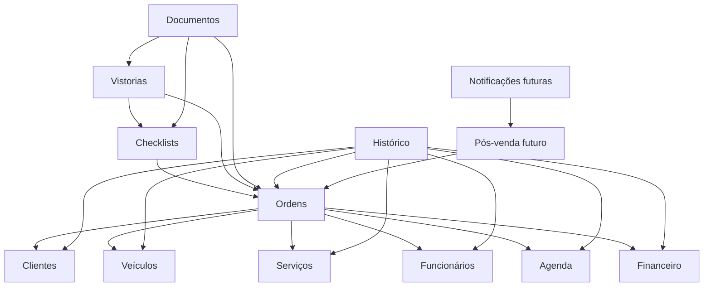

# Mapa de módulos do Barracar Gestão

## Como ler este mapa

Este é o mapa do código atual para os limites propostos. “Arquivos atuais” descreve onde a responsabilidade está hoje; não é uma ordem para mover tudo. Uma migração ocorre apenas quando o módulo for escolhido no plano incremental.

## Visão geral

| Módulo | Dono de | Dependências permitidas | Entidades principais | Entradas/rotas atuais | Arquivos atuais relevantes |
| --- | --- | --- | --- | --- | --- |
| Autenticação | login, sessão, rate limit de login, resolução do ator | Usuários, platform/config, database | `User` (credenciais e estado) | `/login`, `/api/auth/*`, middleware | `auth.ts`, `middleware.ts`, `app/actions.ts`, `lib/auth-security.ts`, `app/login/page.tsx` |
| Usuários | conta interna, papel, ativação e vínculo com funcionário | Autenticação, Funcionários | `User`, `Role` | hoje sem CRUD próprio | `prisma/schema.prisma`, `prisma/seed.ts`, `auth.ts` |
| Clientes | cadastro e consulta de clientes | platform/auth, database | `Customer`, `PersonType` | `/clientes` | `app/(private)/clientes/page.tsx`, `app/(private)/clientes/actions.ts`, `components/customer-form.tsx` |
| Veículos | cadastro, placa normalizada, vínculo com cliente | Clientes | `Vehicle` | `/veiculos` | `app/(private)/veiculos/page.tsx`, `app/(private)/veiculos/actions.ts`, `lib/domain.ts` |
| Funcionários | cadastro, ativação e dados de execução | Usuários | `Employee` | `/funcionarios` | `app/(private)/funcionarios/page.tsx`, `app/(private)/funcionarios/actions.ts` |
| Serviços | catálogo, preço padrão, duração e intervalo de manutenção | platform/auth, database | `Service`, `ServiceCategory` | `/servicos` | `app/(private)/servicos/page.tsx`, `app/(private)/servicos/actions.ts` |
| Ordens de serviço | ciclo da OS, itens, preço, desconto, status e orquestração | Clientes, Veículos, Serviços, Funcionários, Agenda, Financeiro, Checklists, Documentos, Vistorias | `WorkOrder`, `WorkOrderItem` | `/ordens`, `/ordens/[id]`, Server Actions | `server/services/work-orders.ts`, `app/(private)/ordens/**`, `components/order-form.tsx`, `components/pay-order-button.tsx` |
| Agenda | compromisso, origem, horário e estado | Clientes, Veículos, Ordens | `Appointment` | `/agenda`; sincronização pela OS | `app/(private)/agenda/page.tsx`, `server/services/work-orders.ts` |
| Financeiro | lançamentos, competência, vencimento, pagamento e auditoria financeira | Ordens, platform/auth | `FinancialEntry` | `/financeiro`; pagar/cancelar pagamento na OS | `app/(private)/financeiro/**`, `server/services/work-orders.ts` |
| Checklists | modelos e respostas por OS | Configurações, Ordens | `ChecklistTemplate`, `ChecklistTemplateItem`, `WorkOrderChecklistItem` | `/configuracoes`; ações em `/ordens/[id]` | `server/services/checklists.ts`, `app/(private)/configuracoes/**`, `app/(private)/ordens/[id]/actions.ts` |
| Vistorias | fotos, categorias, regiões, avarias, bloqueio e exclusão lógica | Ordens, Checklists, Serviços, platform/storage | `InspectionPhoto` e enums de vistoria | ações em `/ordens/[id]`; `/api/media/photos/[id]`; `/api/work-orders/[id]/photo-options` | `server/services/media.ts`, `components/photo-upload.tsx`, `components/photo-gallery.tsx`, APIs de foto/opções |
| Documentos | assinaturas, geração, versão, validade e download do PDF | Ordens, Vistorias, Checklists, Configurações, platform/storage | `Signature`, `GeneratedDocument` | ações em `/ordens/[id]`; APIs de assinatura/documento | `server/services/documents.ts`, parte de `server/services/media.ts`, `components/signature-pad.tsx`, APIs de mídia |
| Histórico | read model temporal, resumo, rankings e exportação | Ordens, Financeiro, Agenda, Clientes, Veículos, Serviços, Funcionários, Documentos (marca) | projeções, sem entidade transacional própria | `/historico`, `/api/history/export` | `server/modules/history/**`, fachada `server/services/history.ts`, `app/(private)/historico/page.tsx`, `app/api/history/export/route.ts`, `lib/history-period.ts`, `lib/csv.ts` |
| Configurações | dados da empresa e modelos operacionais configuráveis | Checklists, platform/auth | `CompanySettings`, modelos de checklist | `/configuracoes` | `app/(private)/configuracoes/**`, `server/branding.ts` |
| Pós-venda | regras de retorno e acompanhamento após serviço | Ordens, Clientes, Veículos, Serviços | futuro read/command model | ainda não implementado | campos `maintenanceIntervalDays` e `createsReminder` em `Service`; roadmap |
| Notificações | entrega deduplicada de lembretes por canal | Pós-venda, platform/jobs | futuro `Notification`/`Job` | ainda não implementado | nenhum arquivo de produção atual |

## Responsabilidades e fronteiras

### Autenticação

- autenticar sem revelar se usuário existe;
- limitar tentativas em uma única instância;
- carregar usuário ativo e revalidar papel no banco;
- produzir um `Actor` seguro para autorização.

Não decide se uma OS encerrada pode ter foto alterada; essa regra pertence a Vistorias.

### Usuários

- manter identidade interna, papel e status;
- vincular opcionalmente conta e funcionário;
- não armazenar permissões específicas de recursos no componente da sidebar.

### Clientes e Veículos

- Clientes são donos dos dados pessoais e do cadastro;
- Veículos são donos da placa normalizada e pertencimento ao cliente;
- Ordens validam a combinação cliente/veículo por interfaces desses módulos.

### Funcionários e Serviços

- Funcionários representam quem executa trabalho, não necessariamente quem autentica;
- Serviços mantêm o catálogo e preço sugerido;
- o preço aplicado numa OS é um snapshot em `WorkOrderItem.unitPrice`, não uma leitura retroativa do catálogo.

### Ordens de serviço

- é o agregado operacional central;
- mantém invariantes de itens, totais, transições e integridade cliente/veículo;
- coordena operações intermodulares dentro do limite transacional necessário;
- não deve editar diretamente detalhes internos de Agenda/Financeiro quando esses módulos tiverem suas interfaces públicas.

### Agenda

- compromissos manuais e originados por OS compartilham a entidade atual;
- `workOrderId @unique` torna a sincronização da OS idempotente;
- somente o fluxo público de Agenda altera compromisso originado por OS.

### Financeiro

- lançamento automático da OS é distinguido do manual;
- `workOrderId @unique` impede duplicação por duplo pagamento;
- lançamento automático só é alterado pelo fluxo de pagamento da OS;
- valores e datas civis seguem as regras da arquitetura principal.

### Checklists e Vistorias

- Checklists possuem modelo e resposta;
- Vistorias possuem evidência fotográfica e suas políticas;
- uma foto pode referenciar resposta de checklist ou item de serviço, sem transferir a propriedade desses registros;
- bytes passam por uma porta de storage, enquanto metadados e auditoria ficam no PostgreSQL.

### Documentos

- Assinaturas ficam neste limite por fazerem parte da evidência documental;
- PDF é imutável por versão;
- somente uma versão é atual, e mudanças relevantes a tornam desatualizada;
- branding é uma dependência de leitura de Configurações/asset da aplicação.

### Histórico

- pode consultar várias tabelas com projeções Prisma próprias;
- não altera entidades de origem;
- não cria um event bus nem duplica toda a persistência;
- pode ser o módulo piloto porque já possui serviço isolado e testes consistentes.

### Pós-venda e Notificações

- permanecem limites conceituais;
- não criar pastas, tabelas ou filas antes de existir caso de uso aprovado;
- ao implementar, Pós-venda decide “o que/quando”; Notificações decide “como entregar e deduplicar”.

## Direção das dependências entre módulos



As setas significam “usa a interface pública de”. Dependência de consulta do Histórico não concede propriedade de escrita.

## Interface pública proposta

Cada módulo migrado expõe somente tipos e casos de uso estáveis:

```ts
// server/modules/work-orders/public.ts
export type { WorkOrderSummary, SaveWorkOrderCommand } from "./application/contracts";
export { saveWorkOrder, markWorkOrderPaid } from "./application/use-cases";
```

Não exportar repositórios Prisma, clientes SDK, modelos internos ou caminhos profundos. Enquanto o módulo ainda está em `server/services`, imports existentes continuam válidos; a regra é aplicada a código novo/migrado.

## Mapeamento atual para a estrutura futura

| Origem atual | Destino eventual | Momento |
| --- | --- | --- |
| `auth.ts`, `lib/authorization.ts`, `lib/auth-security.ts` | `server/platform/auth/` e módulo `auth` | fase 1, mantendo arquivos de compatibilidade |
| `lib/errors.ts`, `lib/action-state.server.ts` | `server/platform/errors/` | fase 1 |
| `lib/db.ts` | `server/platform/database/` | quando o primeiro adaptador Prisma for criado |
| `lib/storage.ts` | `server/platform/storage/` | fase 4 ou piloto de Documentos/Vistorias |
| `server/services/history.ts` | `server/modules/history/{application,adapters}` | candidato principal da fase 2 |
| `server/services/documents.ts` | `server/modules/documents/` | fase 2 alternativa ou fase 4 |
| `server/services/media.ts` | `server/modules/inspections/` e parte de `documents/` | fase 2 alternativa/fase 4 |
| `server/services/work-orders.ts` | `server/modules/work-orders/` | fase 3 |
| `server/services/checklists.ts` | `server/modules/checklists/` | quando tocado ou junto de Vistorias |
| `app/(private)/*/actions.ts` com Prisma direto | caso de uso do respectivo módulo | fase 5, somente ao alterar o fluxo |
| APIs de mídia com Prisma/storage direto | adaptador de entrada chamando casos de uso | fase 4 |

## Prioridade e risco de migração

| Módulo | Prioridade | Risco | Motivo |
| --- | --- | --- | --- |
| Histórico | alta como piloto | baixo | read-only, serviço e testes já existem |
| Documentos | alta | médio | versionamento, PDF e storage exigem cuidado |
| Vistorias | alta | médio | evidência privada e regras por estado |
| Ordens | alta após piloto | alto | agregado central e várias transações intermodulares |
| Auth/erros/observabilidade | alta como fundação | médio | transversal; exige compatibilidade gradual |
| Financeiro/Agenda | média | alto | consistência com Ordens e dados sensíveis |
| Cadastros | baixa/média | baixo | CRUD funcional; migrar apenas quando evoluir |
| Pós-venda/Notificações | futura | indefinido | ainda sem caso de uso implementado |

## Regras de revisão

Uma mudança de módulo deve responder:

1. Quem é o dono da decisão?
2. A importação passa por `public.ts`?
3. Onde começa a transação?
4. Qual capacidade autoriza o ator?
5. A repetição é segura?
6. Que informação pode aparecer no erro/log?
7. Há teste positivo e negativo proporcional ao risco?
